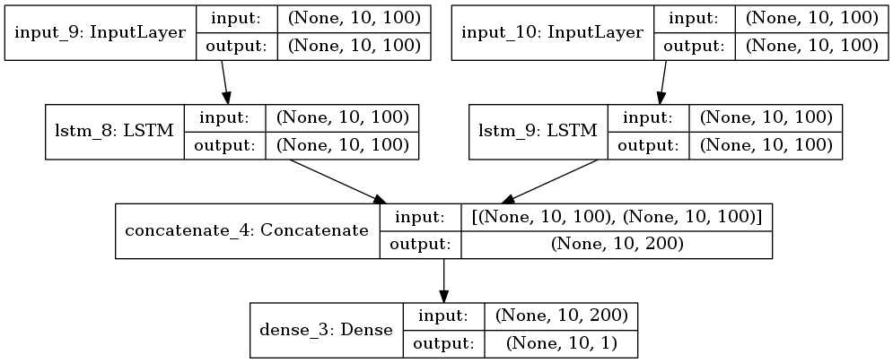

# Points after an extreme week of analysis
+ The data has been **stripped off** punctuations and unnecessary characters.
+ The maximum length of a query is **214**. So we must have a 0 padding length of 214.
+ We are using `tf.data` api for handling data input operations. 
+ We use a pretrained GloVe embeddings as our source for word vectors. Here I have a query about the concreteness of a particular dimensionality. The embeddings are available in 50, 100, 200 and 300 dimensional word embeddings. So which one should I use?

### Basic model outline

